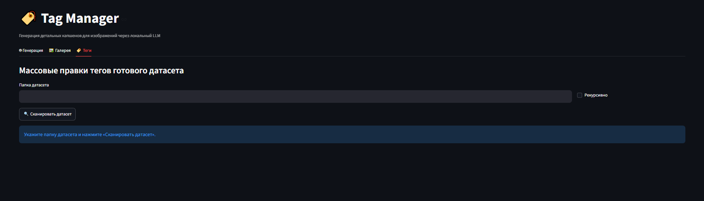
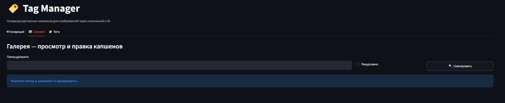
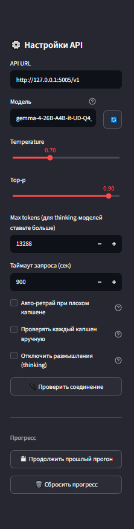

<div align="center">

# 🏷️ Tag Manager

[](README.md)&nbsp;[](README.en.md)

Generate and edit hybrid captions (booru tags + natural language) for LoRA training
datasets — locally, with your own vision models.


<b>Caption generation</b><br>


<details>
<summary>More screenshots</summary>
<br>
<table>
<tr>
<td align="center" width="50%"><b>“Tags” tab</b><br><sub>bulk dataset edits</sub><br></td>
<td align="center" width="50%"><b>“Gallery” tab</b><br><sub>view and edit</sub><br></td>
</tr>
</table>
<b>Sidebar — API settings and generation parameters</b><br>

</details>

</div>

## Why

To train a LoRA or a fine-tune, every image needs a text file next to it with a
description: `cat.jpg` → `cat.txt`. Doing that by hand for hundreds of images is a long,
dull evening.

Tag Manager writes the captions for you: point it at a folder, and it runs the folder
through a local vision model and writes captions using your prompt. Once the dataset is
ready, you can bulk-edit the same files: fix tags, add a trigger word, browse the
gallery.

Runs fully locally. All you need is your own vision model behind an OpenAI-compatible API.

## Features

- Caption generation via a local VLM (OpenAI-compatible API)
- Hybrid format: booru tags + natural-language description
- Bulk tag editing — with preview and a `.bak` backup
- Trigger word across the whole dataset at once
- Gallery with tag search, manual edit and delete
- Pause and resume on long runs

## Why not WD14

WD14 only produces booru tags. Some modern models (Anima, for example) do better on mixed
captions: tags + a natural-language description. Tag Manager lets you get such captions
from a VLM and then edit them comfortably.

## What you need

- **Python 3.10+**
- A running server with a **vision** model and an OpenAI-compatible API. Tested with
  [oobabooga](https://github.com/oobabooga/text-generation-webui) and
  [llama.cpp](https://github.com/ggerganov/llama.cpp). Any multimodal model works:
  Qwen2-VL, LLaVA, Pixtral, MiniCPM-V, Gemma 3, Llama 3.2 Vision.

You start the model yourself — e.g. in oobabooga on the *Model* tab. Tag Manager doesn't
load it: it just connects to an already-running OpenAI-compatible API. A plain text model
won't do — it will ignore the image.

## Install

```bash
git clone https://github.com/OrcPoin/tag-manager.git
cd tag-manager
pip install -r requirements.txt
streamlit run app.py
```

On Windows you can double-click **`run.bat`** instead of the last command.

## How to use

1. In the sidebar, set the API address (e.g. `http://127.0.0.1:5000/v1`) and the model
   name, then click “Check connection”.
2. Pick a folder of images, a processing mode and a prompt (presets are included).
3. Optionally set a trigger word — it goes on the first line of every `.txt`.
4. Click “Start”.

Generation runs in the background, so the UI stays responsive even on long runs: you can
pause and edit captions by hand. Progress is saved to `progress.json` — you can stop and
continue later; in resume mode the app only finishes the unprocessed files.

Once the dataset is ready, the **“Tags”** and **“Gallery”** tabs let you tidy up: check
tag frequencies, bulk-edit tags (with preview and `.bak`), set the trigger word, browse
the gallery with search by tag. Edits only touch the tag lines — prose and parenthesized
character blocks are left alone.

## Caption format

You define the format with your prompt. The default preset produces a “tags + prose”
hybrid, handy for a style LoRA:

```
1girl, blue hair, smile, school uniform, outdoors, day

A medium shot with the subject centered.

(blue hair, on the left: she waves at the viewer, smiling.)
```

This format suits models that understand both booru tags and a description of the scene
at once.

Bulk operations understand this format and only edit the tag line, leaving the prose
untouched.

## FAQ

**Generation takes 8–10 minutes — is that normal?**
For thinking models on complex scenes — yes. The timeout and `Max tokens` in `config.py`
are set generously so a long but correct analysis doesn't get cut off. Simple images are
faster.

**I broke tags with a bulk edit. How do I undo?**
Before every such operation a `.bak` is created next to the file. The “Tags” tab has an
undo button that restores the `.txt` from the backup.

**Where are settings and presets stored?**
In the app folder: `settings.json`, `presets.json`, log in `processing_log.txt`. All
local, never committed.

## License

[MIT](LICENSE) © OrcPoin
