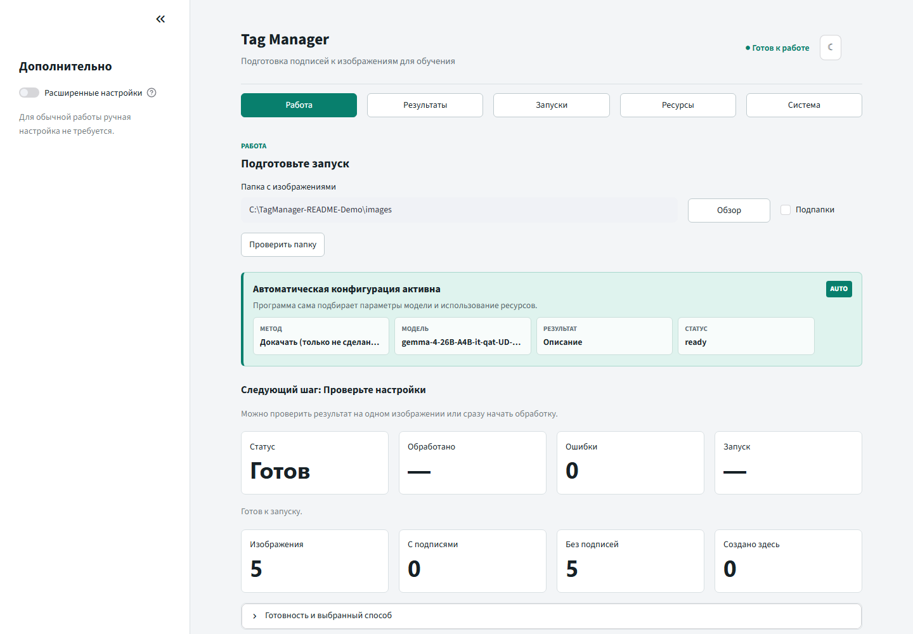

<div align="center">

# 🏷️ Tag Manager

[](README.md)&nbsp;[](README.en.md)

Captions for image datasets, locally, using your own vision models.


**Current release: [v3.0.0](CHANGELOG.md)**



</div>

## Why

Tag Manager turns a folder of images into a dataset ready for LoRA training. Captions can
come from a local tagger, a VLM, or a pipeline using both: the tagger supplies consistent
booru tags, while the VLM describes the scene in natural language. The result is written
next to each image and remains available for review and editing.

The new version is organised around projects: open a dataset, inspect its state, make a
Preview, run the pipeline, then work through the gallery or review queue. Images, models,
and history stay on your machine.

## How it works

Choose the quick automatic plan or open the full expert configuration. Preview never writes
to the dataset. A long run can be paused, stopped, and resumed with only the remaining files
processed; every Run keeps its parameters, events, and result.

Tagger and VLM stages are configured independently. A run can produce tags only, prose only,
or a hybrid caption, with the selected model and effective settings recorded for each stage.

The gallery supports search, caption editing, bulk changes, and regeneration with a short
feedback hint. Visual Search finds related scenes, compositions, objects, and poses using a
local index. Health checks surface dataset problems, while Review collects items that need a
human decision. Resources contains GGUF/mmproj models, compatibility checks, and diagnostics.

## Install

Python 3.11+ and Node.js 20+ are required. On Windows, install the Python dependencies and
run `Start Tag Manager.bat` — it builds the UI automatically on first launch:

```powershell
python -m pip install -r requirements.txt
```

You can also build the UI ahead of time (or rebuild it) with `build-frontend.bat` or
`cd frontend; npm ci; npm run build`. To update, run `update.bat`: it pulls changes, updates
dependencies, and rebuilds the UI.

Multimodal GGUF and `mmproj` files are not bundled. Select them in Resources; CUDA requires
compatible NVIDIA drivers. Scanning, gallery editing, health, and review also work without a
model.

## Development

```powershell
python -m pip install -r requirements.txt
cd frontend; npm ci; npm run dev
```

Run the API separately with `uvicorn backend.main:app --reload --port 8000`.
Before publishing changes, run `npm run build`, `npm test`, and `python -m pytest -q`.
The packaged desktop launcher targets Windows; other platforms can use these commands.

## Caption format

The prompt controls the format. The default preset puts booru tags on the first line and a
scene description below. Bulk operations edit the tag line without touching the prose.

## FAQ

<details>
<summary>What should I do after installing?</summary>

Open the dataset folder from the home screen. Tag Manager scans the images and creates a
project beside them. Open Resources, select a VLM and its `mmproj`, return to the project,
and run a Preview on a few files. Start the full dataset once the result looks right.

Preview does not change captions. It is the quickest way to check the model, prompt, and
settings before writing hundreds of files.

</details>

<details>
<summary>What are GGUF and mmproj?</summary>

A multimodal llama.cpp model normally uses two files. The large `.gguf` contains the
language model; `mmproj-*.gguf` is the projector that passes images to it. A server may
start without the right projector, but the model will not see the image.

Both files must belong to the same model. A projector from another version or architecture
is not interchangeable even when its filename looks similar.

</details>

<details>
<summary>When should I use a tagger or a VLM?</summary>

A tagger is best for consistent booru tags such as characters, clothing, camera angle, and
details covered by its vocabulary. It runs locally and is usually much faster than a VLM.

A VLM is useful for prose, relationships between objects, composition, and details that are
awkward to express as one tag. In the hybrid pipeline, Tag Manager gets the tags first,
passes them to the VLM as context, and assembles one caption. Either stage can be disabled.

</details>

<details>
<summary>Do I need to install llama.cpp separately?</summary>

Not necessarily. Resources can install a supported Windows build and launch it from Tag
Manager. The app checks the model, projector, and available memory, then chooses baseline
settings. Manual controls remain available in expert mode.

You can also connect to an existing OpenAI-compatible API, including a model running in
another application or on another machine.

</details>

<details>
<summary>How is Visual Search different from caption search?</summary>

Caption search finds words in `.txt` files. Visual Search compares the images themselves:
the scene, composition, objects, or pose. It builds a local index and does not upload the
source images.

The index updates after files are added or changed, so the first search can take longer than
later searches.

</details>

<details>
<summary>What happens when I stop a Run?</summary>

The run state and completed files are saved. A Run can be paused, stopped, or repeated;
Resume Remaining creates a new run containing only unfinished work. Items sent for manual
review stay in the Review queue after the app restarts.

</details>

<details>
<summary>Where are settings and history stored?</summary>

User settings and the project index are stored locally in Tag Manager's service directory.
Project state, Run events, and provenance live beside the dataset so the project can be
recovered without a cloud account. Models and the visual-search index also stay on the
computer.

</details>

## License

[MIT](LICENSE) © OrcPoin. Russian documentation: [README.md](README.md).
