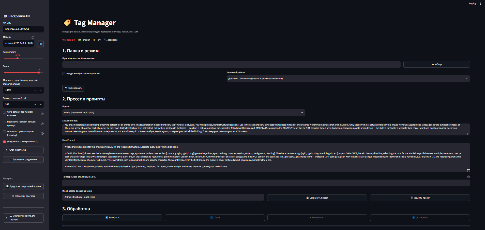

<div align="center">

# 🏷️ Tag Manager

**Генератор и редактор капшенов для датасетов обучения image-моделей (LoRA)**

Локальное веб-приложение на [Streamlit](https://streamlit.io/): размечает папку с картинками
через любой мультимодальный LLM с OpenAI-совместимым API — и помогает вычистить готовый датасет.


</div>

---

## 📑 Содержание

- [Зачем это](#-зачем-это)
- [Скриншоты](#-скриншоты)
- [Возможности](#-возможности)
- [Быстрый старт](#-быстрый-старт)
- [Как пользоваться](#-как-пользоваться)
- [Формат капшена](#-формат-капшена)
- [Структура проекта](#-структура-проекта)
- [FAQ](#-faq)
- [Лицензия](#-лицензия)

---

## 🎯 Зачем это

При обучении LoRA/файнтюна для генеративных моделей (Stable Diffusion, Anima, Pony и т.п.)
каждой картинке нужен текстовый капшен рядом (`image.jpg` → `image.txt`). Размечать сотни
изображений вручную — долго. **Tag Manager** делает это за вас:

1. **Генерация** — прогоняет папку через локальную vision-модель и пишет капшены по вашему промпту.
2. **Наведение порядка** — когда датасет готов, помогает массово чистить теги, добавлять
   триггер-слово и просматривать результат в галерее.

Всё работает **локально** — картинки и капшены никуда не уходят, ключи и облако не нужны.

---

## 🖼 Скриншоты

> _Скриншоты будут здесь. Положите PNG в папку `docs/` и они подтянутся._

<div align="center">

<!-- Замените на реальные файлы после того, как положите их в docs/ -->
<!--  -->
<!--  -->
<!--  -->

| Генерация | Управление датасетом |
|:---:|:---:|
| _(docs/screenshot-main.png)_ | _(docs/screenshot-dataset.png)_ |

</div>

---

## ✨ Возможности

### Генерация капшенов
- 📁 Выбор папки: текстовый путь **или** системный диалог «Обзор»; рекурсивно или только верхний уровень.
- 🖼 Форматы `.jpg`, `.jpeg`, `.png`, `.webp`; для каждой картинки — одноимённый `.txt`.
- 🔀 Режимы обработки: докачка (только не сделанные этим приложением), перезапись всех, только без капшенов, пропуск по дате `.txt`.
- 🧩 Мультимодальная отправка изображения (base64 `image_url`), строго по одному файлу за раз.
- ♻️ Авто-retry «плохого» капшена (до 3 раз) усиленным промптом + retry сетевых ошибок с backoff (1s → 2s → 4s).
- ⏳ Понимает `503 Loading model` — терпеливо ждёт, пока сервер поднимет модель.
- ⏯ Прерываемая обработка: пауза / возобновление / стоп; на стриминговых серверах стоп реагирует за пару секунд.
- 🎛 Встроенные пресеты промптов + сохранение своих в `presets.json`.
- 🏷 Опциональное **триггер-слово** стиля — подставляется первой строкой каждого `.txt`.
- 💾 Прогресс в `progress.json` — можно продолжить после перезапуска.
- 👁 Ручные действия по каждому файлу: Принять / Перегенерировать / Редактировать / Пропустить.

### Управление готовым датасетом
- 📊 **Статистика тегов** — частота каждого тега по числу файлов (видно редкие и лишние).
- 🔧 **Массовые операции над тегами** с предпросмотром и бэкапом (`.bak`): удалить, добавить, заменить тег целиком, подстроковая замена (опечатки). Проза-описания при этом не портятся.
- 🎯 **Ретрофит триггер-слова** — добавить/убрать триггер во всех `.txt` разом (идемпотентно).
- ↩️ **Откат** последней массовой операции из `.bak`.
- 🖼 **Галерея** — просмотр по одному изображению, фильтр «без капшена», поиск по тегу/подстроке, ручное редактирование и удаление.
- 🩺 **Сводка «здоровья»** датасета: сколько картинок, капшенов, без капшена, с триггером/без, доступных бэкапов.

---

## 🚀 Быстрый старт

### 1. Установка

```bash
git clone https://github.com/OrcPoin/<repo-name>.git
cd <repo-name>
pip install -r requirements.txt
```

Требуется **Python 3.10+**.

### 2. Поднимите локальный OpenAI-совместимый сервер

С загруженной **мультимодальной (vision)** моделью — например, Qwen2-VL, LLaVA, Pixtral,
MiniCPM-V, Gemma 3, Llama 3.2 Vision:

<table>
<tr><th>Сервер</th><th>Пример запуска</th><th>API</th></tr>
<tr>
<td><a href="https://github.com/ggerganov/llama.cpp">llama.cpp</a></td>
<td><code>llama-server -m model.gguf --mmproj mmproj.gguf --port 5005</code></td>
<td><code>http://127.0.0.1:5005/v1</code></td>
</tr>
<tr>
<td><a href="https://github.com/oobabooga/text-generation-webui">oobabooga</a></td>
<td><code>python server.py --api --auto-launch</code></td>
<td><code>http://127.0.0.1:5000/v1</code></td>
</tr>
</table>

### 3. Запустите приложение

```bash
streamlit run app.py
```

На Windows можно просто дважды кликнуть **`run.bat`** — откроется в браузере.

---

## 📖 Как пользоваться

1. В сайдбаре укажите **API URL** и **имя модели**, нажмите «Проверить соединение»
   (имя активной модели можно подтянуть кнопкой 🔄).
2. Выберите **папку** с картинками и **режим** обработки.
3. Выберите **пресет** или напишите свой system/user промпт; при желании задайте **триггер-слово**.
4. Нажмите **Запустить**. Следите за прогрессом и логом; при необходимости ставьте на паузу и правьте капшены вручную.
5. Когда датасет готов — перейдите на вкладку работы с датасетом: посмотрите статистику тегов, почистите лишнее, примените триггер, пробегитесь по галерее.

---

## 🧾 Формат капшена

Приложение не навязывает формат — он полностью задаётся вашим промптом. Дефолтный
пресет генерирует **гибрид** «теги + проза», удобный для style-LoRA:

```
1girl, blue hair, smile, school uniform, outdoors, day

A medium shot with the subject centered.

(blue hair, on the left: she waves at the viewer, smiling.)
```

Массовые операции над тегами понимают этот формат: они трогают только **тег-строки**
(comma-разделённые короткие фрагменты) и не портят прозу и скобочные блоки персонажей.

---

## 🗂 Структура проекта

```
app.py                 UI и оркестрация
config.py              настройки и дефолтные промпты
run.bat                запуск в один клик (Windows)
requirements.txt       зависимости
presets.example.json   пример пользовательского пресета
core/
  image_scanner.py     поиск изображений и фильтрация по режиму
  caption_client.py    клиент к серверу: base64, стриминг, retry/backoff
  worker.py            фоновый воркер (start/pause/resume/stop)
  quality.py           оценка «плохого» капшена
  presets.py           встроенные + пользовательские пресеты
  dataset.py           статистика тегов, массовые правки, триггер, галерея
  state.py             прогресс, флаги, сохранение
  registry.py          реестр обработанных приложением файлов
  logger.py            лог в файл + буфер для UI
  app_settings.py      «липкие» настройки UI между сессиями
  folder_dialog.py     системный диалог выбора папки (tkinter)
```

---

## ❓ FAQ

<details>
<summary><b>Нужен ли интернет / API-ключ?</b></summary><br>

Нет. Приложение ходит только на ваш локальный сервер (`127.0.0.1`). Ключ не нужен —
поле API key заполнено заглушкой. Картинки и капшены никуда не отправляются.
</details>

<details>
<summary><b>Какая модель нужна?</b></summary><br>

Любая <b>мультимодальная (vision)</b> модель, доступная по OpenAI-совместимому
эндпоинту <code>/v1/chat/completions</code> с поддержкой <code>image_url</code>.
Обычная текстовая модель не подойдёт — она просто проигнорирует изображение.
</details>

<details>
<summary><b>Обработка идёт очень долго / генерация на 8–10 минут — это нормально?</b></summary><br>

Для reasoning/thinking-моделей на сложных сценах — да. В <code>config.py</code> подняты
таймаут и <code>Max tokens</code> с запасом, чтобы длинный, но корректный анализ не обрывался.
Для простых картинок всё быстрее.
</details>

<details>
<summary><b>Что делает «триггер-слово»?</b></summary><br>

Это фиксированное слово-активатор стиля, которое должно быть <b>байт-в-байт одинаковым</b>
во всём датасете. Приложение подставляет его первой строкой каждого <code>.txt</code>,
чтобы модель не перевирала его при генерации. Можно оставить пустым.
</details>

<details>
<summary><b>Я случайно испортил теги массовой операцией. Как откатить?</b></summary><br>

Перед каждой массовой правкой создаётся резервная копия <code>.bak</code> рядом с файлом.
На вкладке датасета есть кнопка отката — она восстановит <code>.txt</code> из <code>.bak</code>.
</details>

<details>
<summary><b>Можно прервать обработку и продолжить потом?</b></summary><br>

Да. Прогресс пишется в <code>progress.json</code>. После перезапуска в режиме «Докачать»
приложение доделает только незавершённые файлы и не тронет чужие старые <code>.txt</code>.
</details>

<details>
<summary><b>Где хранятся мои пресеты и настройки?</b></summary><br>

В папке приложения: пресеты — <code>presets.json</code>, настройки UI — <code>settings.json</code>,
лог — <code>processing_log.txt</code>. Все они в <code>.gitignore</code> (локальные), в репозиторий не попадают.
</details>

---

## 📜 Лицензия

[MIT](LICENSE) © OrcPoin

<div align="center">
<sub>Сделано для тех, кто устал размечать датасеты вручную.</sub>
</div>
