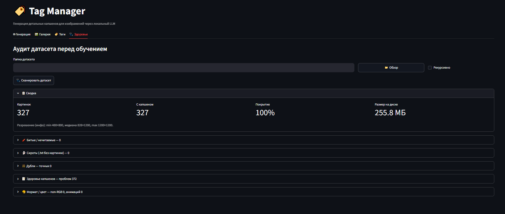

<div align="center">

# 🏷️ Tag Manager

[](README.md)&nbsp;[](README.en.md)

Генерация и правка гибридных подписей (booru-теги + описание естественным языком) для
датасетов обучения LoRA — локально, через ваши vision-модели.


<b>Генерация подписей</b><br>


<details>
<summary>Ещё скриншоты</summary>
<br>
<table>
<tr>
<td align="center" width="50%"><b>Вкладка «Теги»</b><br><sub>массовые правки датасета</sub><br></td>
<td align="center" width="50%"><b>Вкладка «Галерея»</b><br><sub>просмотр и правка</sub><br></td>
</tr>
<tr>
<td align="center" width="50%"><b>Вкладка «Здоровье»</b><br><sub>аудит датасета перед обучением</sub><br></td>
<td align="center" width="50%"><b>Сайдбар</b><br><sub>настройки API и генерации</sub><br></td>
</tr>
</table>
</details>

</div>

## Зачем

Чтобы обучить LoRA или файнтюн, рядом с каждой картинкой нужен текстовый файл с
описанием: `cat.jpg` → `cat.txt`. На сотнях изображений писать это руками — долгий
монотонный вечер.

Tag Manager создаёт подписи за вас: показываете ему папку — он прогоняет её через
локальную vision-модель и пишет капшены по вашему промпту. Когда датасет готов, те же
файлы можно массово отредактировать: поправить теги, добавить триггер-слово, пройтись по
галерее.

Работает полностью локально. Достаточно поднять свою vision-модель с
OpenAI-совместимым API.

## Возможности

- Генерация подписей через локальную VLM (OpenAI-совместимый API)
- Гибридный формат: booru-теги + описание естественным языком
- Массовое редактирование и чистка тегов (дубли, пробелы, регистр) — с предпросмотром и бэкапом `.bak`
- Триггер-слово во всём датасете разом
- Галерея с поиском по тегу, ручной правкой и удалением
- Аудит датасета перед обучением: битые файлы, дубли, сироты, проблемные капшены
- Пауза и докачка на долгих прогонах

## Почему не WD14

WD14 генерирует только booru-теги. Некоторые современные модели (например Anima) лучше
работают на смешанных подписях: теги + описание естественным языком. Tag Manager позволяет
получать такие подписи через VLM и затем удобно их редактировать.

## Что нужно

- **Python 3.10+**
- Запущенный сервер с **vision**-моделью и OpenAI-совместимым API. Проверено с
  [oobabooga](https://github.com/oobabooga/text-generation-webui) и
  [llama.cpp](https://github.com/ggerganov/llama.cpp). Подойдёт любая мультимодальная
  модель: Qwen2-VL, LLaVA, Pixtral, MiniCPM-V, Gemma 3, Llama 3.2 Vision.

Модель вы запускаете сами — например, в oobabooga на вкладке *Model*. Tag Manager её не
грузит: просто подключается к уже работающему OpenAI-совместимому API. Обычная текстовая
модель не подойдёт — она проигнорирует изображение.

## Установка

```bash
git clone https://github.com/OrcPoin/tag-manager.git
cd tag-manager
pip install -r requirements.txt
streamlit run app.py
```

На Windows можно вместо последней команды дважды кликнуть **`run.bat`**.

## Как пользоваться

1. В сайдбаре укажите адрес API (например `http://127.0.0.1:5000/v1`) и имя модели,
   нажмите «Проверить соединение».
2. Выберите папку с картинками, режим обработки и промпт (есть готовые пресеты).
3. При желании задайте триггер-слово — оно встанет первой строкой каждого `.txt`.
4. Нажмите «Запустить».

Генерация идёт в фоне, поэтому интерфейс не виснет даже на долгих прогонах: обработку
можно поставить на паузу и править капшены вручную. Прогресс пишется в `progress.json` —
можно прервать и продолжить позже; в режиме докачки приложение доделает только
незавершённые файлы.

Когда датасет готов, вкладки **«Теги»** и **«Галерея»** дают навести порядок: посмотреть
частоты тегов, массово поправить их (с предпросмотром и `.bak`), проставить триггер,
пробежать по галерее с поиском по тегу. Правки трогают только тег-строки — проза и
скобочные блоки персонажей не портятся. Перед самим обучением вкладка **«Здоровье»**
покажет битые файлы, дубли, сироты и слабые капшены, а лишнее уберёт в карантин.

## Формат капшена

Формат задаёте вы промптом. Дефолтный пресет даёт гибрид «теги + проза», удобный для
style-LoRA:

```
1girl, blue hair, smile, school uniform, outdoors, day

A medium shot with the subject centered.

(blue hair, on the left: she waves at the viewer, smiling.)
```

Такой формат хорошо подходит для моделей, понимающих одновременно booru-теги и описание
сцены.

Массовые операции понимают этот формат и правят только строку тегов, не задевая прозу.

## FAQ

**Генерация идёт 8–10 минут — это нормально?**
Для thinking-моделей на сложных сценах — да. Таймаут и `Max tokens` в `config.py` подняты
с запасом, чтобы длинный, но корректный анализ не обрывался. Простые картинки — быстрее.

**Испортил теги массовой правкой. Как откатить?**
Перед каждой такой операцией рядом с файлом создаётся `.bak`. На вкладке «Теги» есть
кнопка отката — она вернёт `.txt` из бэкапа.

**Где хранятся настройки и пресеты?**
В папке приложения: `settings.json`, `presets.json`, лог — `processing_log.txt`. Все
локальные, в репозиторий не попадают.

## Лицензия

[MIT](LICENSE) © OrcPoin
